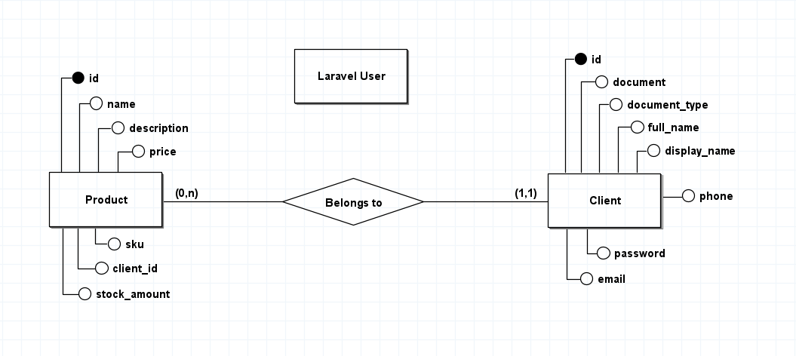

## :rocket: Teste técnico para Desenvolvedor(a) Back-end Pleno na Ensinio

Este teste foi planejado para validar os conhecimentos necessários para a posição de Desenvolvedor(a) Back-end Pleno na Ensinio.

Serão avaliados aspectos relacionados aos conhecimentos em boas práticas de desenvolvimento, além dos conhecimentos nas tecnologias PHP, Laravel, e no seu ecosistema.

É esperado que você codifique com organização e siga os padrões determinados (estamos confiantes de que você pode vencer a vontade de fazer gambiarras :stuck_out_tongue_winking_eye:), e demonstre sua atenção em detalhes, capacidade de aprender e agregar valor.

Esperamos também que você se divirta e aprenda algo no processo. :blush:

## :bulb: A proposta

Você deve codificar, utilizando utilizando **PHP + Laravel 8**. (Utilize o [_Laravel Breeze_](https://laravel.com/docs/8.x/starter-kits#laravel-breeze) e [_Inertia.js_](https://laravel.com/docs/8.x/starter-kits#breeze-and-inertia).), um CRUD de clientes e produtos, onde os clientes são os donos do _produto_ e os produtos irão pertencer a uma loja específica(A loja não faz parte do CRUD) em um cenário de **Marketplace**. Segue abaixo um modelo conceitual de banco de dados abaixo (o diagrama abaixo não inclui o modelo das lojas):

Para consumir a API **dos produtos dos clientes** utilize o modelo SPAs (single page applications), utilze o [_Laravel Sanctum_](https://laravel.com/docs/8.x/sanctum) do Laravel. 
Obs: Não é necessário criar a API de visualizar o produto do cliente, mas sim a API para consultar os produtos disponíveis de todos os clientes.

Documente a API utilizando alguma ferramenta integrada como o [Swagger](https://swagger.io) ou congêneres.

--------

_As lojas devem ser importadas dos arquivos **em Json disponível neste repositório**_. Como requisito, é necessário desenvolver com abstrações dos dados importados.
Imagine que você possua produtos em diferentes lojas, por exemplo, no Mercado Livre, OLX, e afins. Suponha agora que você deseja realizar uma integração para vender todos os seus produtos em um único lugar. Para isso, é necessário consultar as APIs das diferentes lojas, e importar seus dados.

Coluna    | Valor  | Descrição
--------- | ------ | ------------------
id | BIGINT UNSIGNED NOT NULL AUTO_INCREMENT | Id único da Loja
name | VARCHAR(255) NOT NUL | Nome da loja
slug | VARCHAR(255) NOT NULL | Slug da loja - `UNIQUE INDEX `lojas` (`slug`)`
driver | VARCHAR(255) NOT NULL | Driver que irá receber as informações do pipeline - `UNIQUE INDEX `lojas` (`driver`)`
driver_meta | JSON NULL DEFAULT NULL | Informações salvas do driver
created_at | TIMESTAMP NULL DEFAULT NULL | Data de criação da loja
updated_at | TIMESTAMP NULL DEFAULT NULL | Data de atualização da loja

Por fim, forneça uma documentação, por meio de um arquivo "documentation.md", acerca do seu projeto. Inclua instruções completas para a execução da aplicação, e comentários que julgar pertinentes à avaliação.

## :dart: Requisitos do projeto

- Organização do código;
- O código deve seguir o padrão PSR2;
- Criar seeders com factory do Laravel para popular o banco de dados;
- Fornecer uma documentação, incluindo instruções para a execução da sua aplicação.
- Aplicar cache;
- Escrever um ou mais testes :)

## :clap: Diferenciais

- Utilizar mais uma camada entre o Modelo e o Controlador;
- Usar broadcasting para atualizar via realtime quando um pipeline for sincronizado;

## :page_facing_up: Critérios de avaliação

- A qualidade do seu **código**;
- O cumprimento dos **requisitos**;
- A **estrutura** do seu projeto: esperamos ver componentização coesa, reuso, encapsulamento, separação de responsabilidades, etc;
- Seu **empenho**: não tem problema se algo não sair como desejado, mas tente! :blush:

## :email: Sobre a entrega

Pedimos que, por gentileza, entregue o teste em até 7 dias a partir do recebimento das instruções, respondendo à **mesma conversa de email onde enviamos o link do desafio** e incluindo o link de um **repositório privado** no GitHub. Neste repositório, **adicione como colaborador o usuário [@ensiniodevback](https://github.com/ensiniodevback)** (jobs@ensinio.com).

Se por motivos de força maior não for possível cumprir com o prazo, por gentileza, nos informe respondendo à mesma conversa de email onde enviamos o link do desafio.
